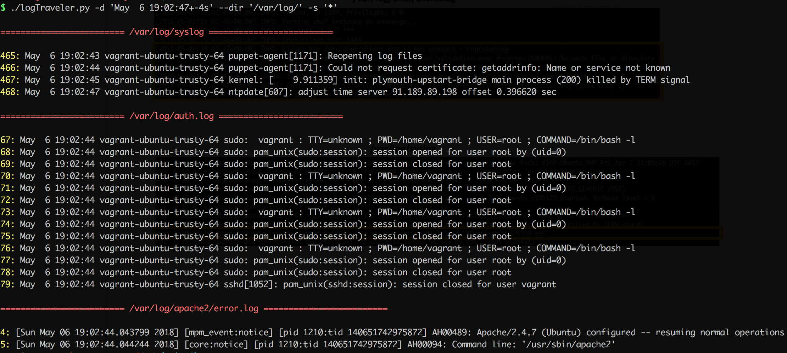

# logtraveler
A simple tool to filter lines of log files based on given datetime range.

The following screenshot illustrates events happened 4 seconds around 'May 6 19:02:47'


Often times while debugging issues,
we will be interested in quickly walk through log lines of
specific datetimestamp in tenths of different 
log files in various directories.
This is especially needed for coordinated micro services running on a host 
or services that are running across hosts in a distributed systems.
It will be more cumbersome, if different datetime format is 
used across log files.  

## Features

* Simple, lightweight and memory efficient tool
* Flexible way to specify datetime range
* Advanced way to specify search paths
(dir and relative dir and filename pattern combinations)
* Support for ".gz" compressed log file is built-in

## Usage

```
usage: logTraveler.py [-h] -d DT [--dir DIR] [-l] [-s SUB] [-f FILE]
                      [--ignore_lineno] [-c] [-n NUM_LINES]

optional arguments:
  -h, --help            show this help message and exit
  -d DT, --dt DT        datetime to filter lines('dt1@dt2' or 'dt' or
                        'dt+num[us|ms|s|m]' or 'dt-num[us|ms|s|m]' or
                        'dt+-num[us|ms|s|m]')
  --dir DIR             comma separated list of directory to search (default
                        pwd: '${PWD}')
  -l, --local           Local log search, --dir will be set to '\'
  -s SUB, --sub SUB     comma separated subdirs pattern to search within --dir
                        , if just '*' is passed recursively searched on all
                        subdirs(default: 'var/log/ , var/nvOS/etc/*/ ,
                        var/nvOS/log/ , var/lib/lxc/*/rootfs/ ,
                        var/lib/lxc/*/rootfs/var/log')
  -f FILE, --file FILE  comma separated file name patterns, provide within
                        quote: (default: '*log*')
  --ignore_lineno       Ignore line number
  -c, --ignore_color    Ignore color
  -n NUM_LINES, --num_lines NUM_LINES
                        Number of lines to search to classify datetime pattern
                        of a file (default: 100)

Supported datetime patterns:

-  %Y-%m-%dT%H:%M:%S.%fZ,
-  %Y-%m-%d,%H:%M:%S.%f,
-  %Y-%m-%d %H:%M:%S,
-  %Y-%m-%d,%H:%M:%S,
-  %a %b %d %H:%M:%S %Y,
-  %b %d %H:%M:%S %Y,
-  %b%d.%H:%M:%S.%f,
-  %b%d.%H:%M:%S,
-  %Y %b %d %H:%M:%S,
-  %b %d %H:%M:%S,

Example Usage:

1) exact datetime
./logTraveler.py -d 'Apr04.10:08:22.627'

2) b/w two datetime
./logTraveler.py -d 'Apr04.10:08:22.627@Apr04.10:10:22.627'

3) 5 sec from specific datetime
./logTraveler.py -d 'Apr04.10:08:22.627+5s'

4) 10ms around specific datetime
./logTraveler.py -d 'Apr04.10:08:22.627+-10ms'

5) Search file name startswith 'nvOSd' or 'route'
./logTraveler.py -d 'Apr04.10:08:22.627-5ms' -f 'nvOSd*,route*'

6) Search all files with the name 'log' in it, within only relative subdirs
'var/log' and pattern 'log/*/test' in directory '/tmp/prj1' and '/tmp/prj2'
./logTraveler.py -d 'Apr04.10:08:22.627-1ms' -f '*log*' -dir '/tmp/prj1,/tmp/prj2' -s 'var/log,log/*/test'

7) Search all files with the name 'log' in it, recursively on all subdirs within dir '/tmp/test'
./logTraveler.py -d 'Apr04.10:08:22.627-+5ms' -f '*log*' -dir '/tmp/test' -s '*'

8) On local host search only on dir 'var/log' for file 'test.log'
./logTraveler.py -d 'Apr04.10:08:22.627-+5ms' -l -f 'test.log' -s 'var/log'
```
## How to install?

Make sure that the machine has python installed (version >= 2.7)
```
curl https://raw.githubusercontent.com/vivekkns/logtraveler/master/logTraveler.py > logTraveler.py; chmod +x logTraveler.py
```
... and to make it handy, add the dir in PATH variable in your
.bashrc or .bash_profile or
any script that is used for initializing your shell session


## Note

For now, predefined patterns are defined within the program
for datetime pattern discovery, which can be extended according to your need.
